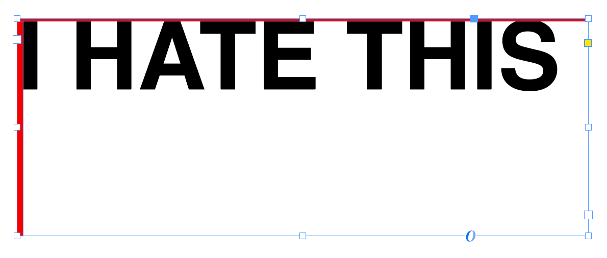

# indesign-scripts: InDesign workflow optimization toolset 

🥲

This collection of scripts is made using **Basil.js** library for various scenarios. Its main goal is improving and simplifying your InDesign routine. From detail typography to generative graphics — you can find everything. 

*I hope...*

## Index

- [indesign-scripts: InDesign workflow optimization toolset](#indesign-scripts-indesign-workflow-optimization-toolset)
  - [**Index**](#index)
  - [🛠️ List of Tools](#%EF%B8%8F-list-of-tools)
  - [📜 Requirements](#-requirements)
  - [⚙️ Installation Guide](#%EF%B8%8F-installation-guide)
  - [😩 Compatibility](#-compatibility)

## 🛠️ List of Tools

- **[align-type.js](/align-type.js)** *Removes the red spacing inside of all text text boxes*
  
  
  
- **Coming soon...**

## 📜 Requirements
  - [Basil.js (Dev)](https://github.com/basiljs/basil.js/tree/develop)
  - Adobe InDesign

## ⚙️ Installation Guide

Since you want to get those scripts running ASAP, follow these steps:

1. At first let's install the **Basil.js** library. *(The instructions can be found [here](https://basiljs2.netlify.app/tutorials/01-getting-started/))*

Run this Terminal/Console command to link the scripts to the InDesign:
  
**MacOS:**
```
ln -s basiljs_PATH Scripts_Panel_PATH
```
**Win:**
```
mklink /d Scripts_Panel_PATH basiljs_PATH
```

Change `basiljs_PATH` to the path of your basil.js directory (Somewhere here `~/Documents/basiljs`) and `Scripts_Panel_PATH` to the path of your InDesign scripts directory by opening the **Window>Utilities>Scripts** in InDesign, right-clicking the User folder, opening it in finder/explorer.

2. Download the scripts by clicking **CODE>Download ZIP** at the top of this page ☝️ 

3. Paste the scripts into the user folder your **basil.js** directory.

4. Open the Scripts panel in InDesign. In the **User** folder you should see your linked **basil.js** directory.

5. To run the scripts just double-click the one you want to execute.

## 😩 Compatibility 
  - Tested in Adobe InDesign 2023 (18.2.1)
  - Working on MacOS Ventura 13.3
